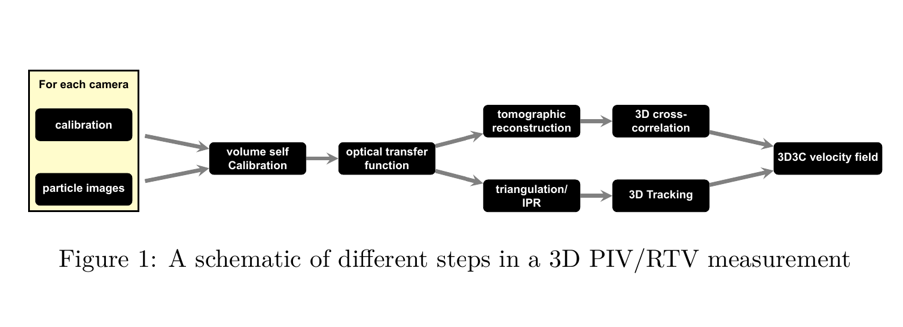

# FlowVis-TikZ

An illustrative LaTeX project utilizing TikZ for creating and explaining a 3D PIV/RTV measurement process flowchart, showcasing complex technical procedures in a visually accessible format.

## Overview

This repository contains a LaTeX project designed to demonstrate the process of 3D Particle Image Velocimetry (PIV) or Real-Time Visualization (RTV) measurement using a detailed flowchart. The project leverages the TikZ package within LaTeX to create an informative and visually engaging diagram that outlines each step of the PIV/RTV measurement process, making complex fluid dynamics research techniques understandable.

## Skills Demonstrated

- Proficiency in LaTeX for high-quality typesetting.
- Expertise in using the TikZ package to design complex diagrams.
- Ability to conceptualize and visualize technical processes through diagrammatic representation.
- Effective communication of intricate technical procedures in a clear and concise manner.

## Project Description

This project showcases a flowchart diagram created in LaTeX with the TikZ package, detailing the steps involved in conducting 3D Particle Image Velocimetry (PIV) or Real-Time Visualization (RTV) measurements. From setting up the experiment, calibrating equipment, capturing and analyzing particle images, to reconstructing the 3D positions and velocities of particles within a fluid, this flowchart serves as a visual guide to understand the methodologies behind fluid dynamics research. The aim is to demystify the technical process, making it accessible to a broader audience.

## Result Image

The flowchart below visualizes the step-by-step process of 3D Particle Image Velocimetry (PIV)/Real-Time Visualization (RTV) measurement, illustrating the intricate workflow from setup to the final 3D3C velocity field analysis.

  <b>Click on the image to open the PDF.</b>

## License

This project is licensed under the Apache License 2.0 - see the [LICENSE](LICENSE) file for details.

---

Copyright (c) [2024] [Paschalis Moschogiannis]

Licensed under the Apache License, Version 2.0 (the "License");
you may not use this file except in compliance with the License.
You may obtain a copy of the License at

   http://www.apache.org/licenses/LICENSE-2.0

Unless required by applicable law or agreed to in writing, software
distributed under the License is distributed on an "AS IS" BASIS,
WITHOUT WARRANTIES OR CONDITIONS OF ANY KIND, either express or implied.
See the License for the specific language governing permissions and
limitations under the License.
 
